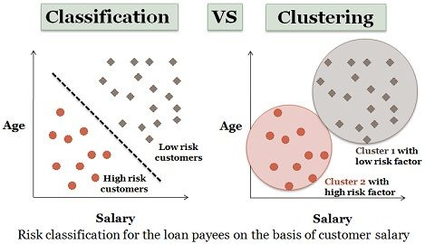
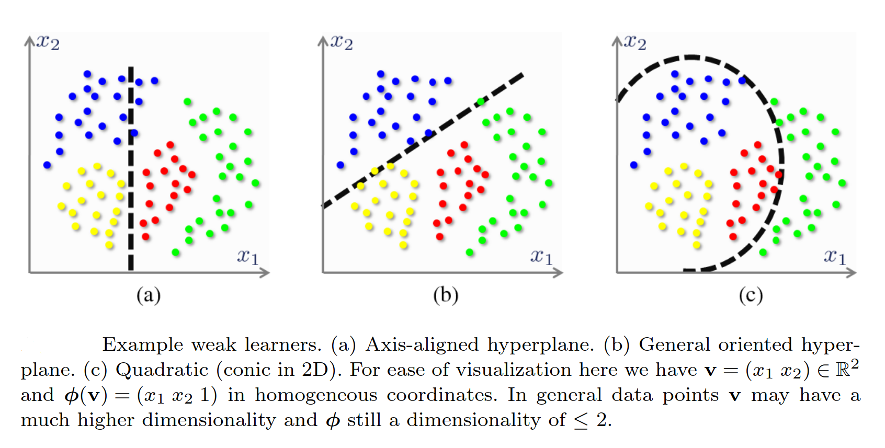
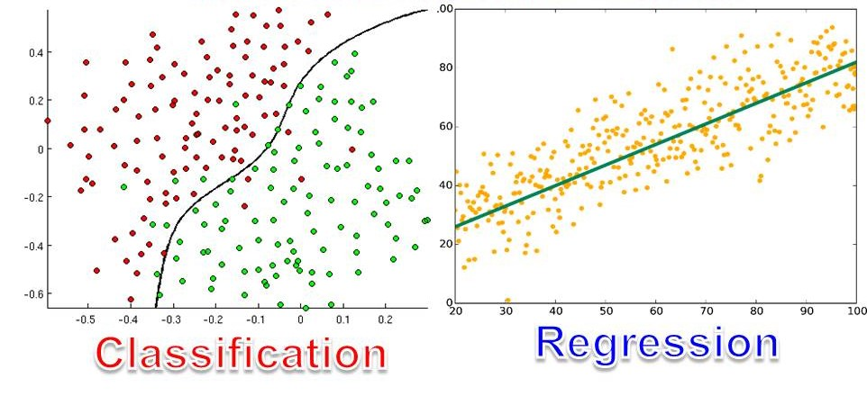
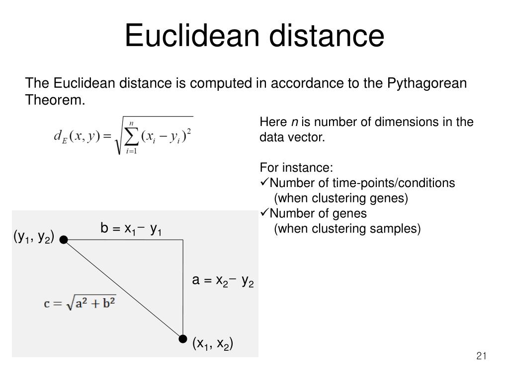
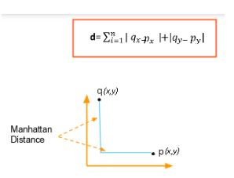
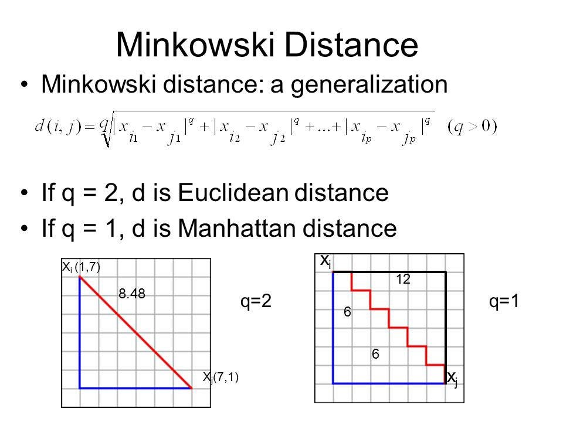

# *What is Pattern Recognition?*

Pattern recognition is the process of identifying and interpreting the patterns, structure and regularities in data set. It is a subfield of machine learning and  Artificial Intelligence. In simple term is automate the process of classification and clustering. 

Real time Example in daily life: In our daily life we use pattern recognition in many ways. For example, we use pattern recognition in face and voice recognition, also finger recognition in mobile phones. Which is drastically changed improving the security of mobile phones and enhancing the user experience.

## *Application of Pattern Recognition?*

1. Speech Recognition: Speech recognition is the process of converting spoken words to text, and it is one of the most complex pattern recognition problems. It is used widely in voice assistants like Alexa, Siri, Google Assistant, etc.

2. Image Recognition: Image recognition is the process of identifying and detecting an object or a feature in a digital image or video. It is used in self-driving cars, face recognition, etc.

3. Medical Diagnosis: Medical diagnosis is the process of identifying a disease by its signs and symptoms. It is used in the diagnosis of diseases like cancer, diabetes, etc.

4. Handwriting Recognition: Handwriting recognition is the process of converting handwritten text to digital text. It is used in converting handwritten documents to digital documents.

5. Fraud Detection: Fraud detection is the process of identifying fraudulent transactions. It is used in credit card fraud detection, insurance fraud detection, etc.

## What is classification and clustering?

Both classification and clustering are used for pattern recognition.

Where classification is a supervised learning approach. It involves training a model using a set of predefined labeled data. The model is trained using the labeled data and then used to predict the class of the new data.

Where clustering is an unsupervised learning approach. It involves grouping the data into clusters based on their similarities. The data points in the same cluster are similar to each other, and the data points in different clusters are dissimilar to each other.

In simple tern classification is a process of sorting of objects according to the there characteristic, where clustering is refer as grouping of similar objects in which data set does not have any predefined labels.

## ***Key difference between classification and clustering***

1. Supervised vs Unsupervised Learning: Classification is a supervised learning approach, whereas clustering is an unsupervised learning approach.

2. Training Data: Classification involves training a model using a set of predefined labeled data. Clustering involves grouping the data into clusters based on their similarities.

3. Goal: The goal of classification is to sorting of objects according to the there characteristic. The goal of clustering is to group the data into clusters based on their similarities.

4. Output: The output of classification is a class label. The output of clustering is a cluster label.

5. Types: Classification is of two types: binary classification and multi-class classification. Clustering is of two types: hard clustering and soft clustering.

6. Algorithms: Classification algorithms include logistic regression, decision trees, random forest, etc. Clustering algorithms include k-means clustering, hierarchical clustering, etc.

## *What are Different Types of Machine Learning algorithms?*

Machine Learning algorithm are broadly classified into three types:

1. ***Supervised Leaning Algorithm***

      **Classification**: Classification is a process of sorting of objects according to the there characteristic. Classification is a supervised learning approach. It involves training a model using a set of predefined labeled data. The model is trained using the labeled data and then used to predict the class of the new data. Classification is of two types: binary classification and multi-class classification. Classification algorithms include logistic regression, decision trees, random forest, etc.

2. ***Unsupervised Learning Algorithm***

      **Clustering**: Clustering is refer as grouping of similar objects in which data set does not have any predefined labels. Clustering is an unsupervised learning approach. It involves grouping the data into clusters based on their similarities. The data points in the same cluster are similar to each other, and the data points in different clusters are dissimilar to each other. Clustering is of two types: hard clustering and soft clustering. Clustering algorithms include k-means clustering, hierarchical clustering, etc.

3. ***Reinforcement Learning Algorithm***
    
     **Reinforcement Learning**: Reinforcement learning is a type of machine learning algorithm that enables an agent to learn in an interactive environment by trial and error using feedback from its own actions and experiences. Reinforcement learning is used in robotics, gaming, etc.

## *Explain decision boundaries and decision region in detail.*

In the context of pattern recognition, both decision boundaries and decision regions are used to classify the data points.

***Decision Boundary***: A decision boundary is a boundary or a separation in the feature space that distinguishes between different classes or categories in a classification problem. It represents the dividing line or surface where a classifier makes decisions about which class a data point belongs to. The decision boundary is determined by the classifier based on the patterns it has learned from the training data.

    a. Linear Decision Boundary: A linear decision boundary is a straight line that separates the feature space into two decision regions. It is used in linear classifiers like logistic regression, support vector machines, etc.

    b. Non-Linear Decision Boundary: A non-linear decision boundary is a curved line that separates the feature space into two decision regions. It is used in non-linear classifiers like decision trees, random forest, etc.

    Example: In image classification, where the features are pixel values, a non-linear decision boundary might be able to capture the complex shapes and patterns in images of different objects. Whereas, a linear decision boundary might not be able to capture the complex shapes and patterns in images of different objects.

***Decision Region***:A decision region is the area or region in the feature space that corresponds to a specific class or category. It is determined by the decision boundary and the classification rules of the classifier. In other words, all data points within a particular decision region are classified into the same class by the classifier.

   a. In a binary classification problem, there are two decision regions: one for each class. Data points falling within the decision region of Class A are classified as Class A, and data points within the decision region of Class B are classified as Class B.

   b. In a multi-class classification problem, each class has its own decision region, and data points within a particular decision region are assigned to that specific class.

   Example: Consider a binary classification problem where you are classifying whether emails are spam or not spam based on the number of spam words and non-spam words. The decision boundary might be a straight line in a two-dimensional space representing the two features, and the decision regions would be the areas on either side of that line. Data points falling on one side of the line would be classified as spam, and data points on the other side would be classified as not spam.

## *What is a feature. Define feature space & feature vector.*

In context of machine learning and data analysis, a 'feature' is a measurable property or characteristic  of data that used to describe the object and phenomenon.
Feature are essential for understanding and making predictions about the data. 

***Feature***: A feature is a measurable property or characteristic of data that used to describe the object and phenomenon. Features are essential for understanding and making predictions about the data.
A feature is an individual attribute or property of data. Features are the building blocks of datasets, and they provide information about the data's characteristics.

Example: Consider a dataset of houses with features like area, number of bedrooms, number of bathrooms, etc. The features in this dataset are area, number of bedrooms, number of bathrooms, etc.

***Feature Space***: A feature space is a multidimensional space that represents the features of a dataset. Each dimension in the feature space represents a feature of the dataset. The number of dimensions in the feature space is equal to the number of features in the dataset.
 In simple term it is a mathematical representation that allows data points to be positioned in this space based on their feature values.
 The feature space is essential for understanding relationships between data points, clustering, and building decision boundaries for classification tasks.

Example: Consider a dataset of houses with features like area, number of bedrooms, number of bathrooms, etc. The feature space for this dataset is a three-dimensional space with three dimensions: area, number of bedrooms, and number of bathrooms.

***Feature Vector***: A feature vector is a specific instance or representation of a data point within the feature space. It is a vector composed of feature values, where each element of the vector corresponds to a particular feature.
Feature vectors are the fundamental input for machine learning models. They allow the model to process and analyze the data.

Example: Consider a dataset of houses with features like area, number of bedrooms, number of bathrooms, etc. The feature vector for a particular house would be a vector with three elements: area, number of bedrooms, and number of bathrooms.

## *Explain different approaches of pattern recognition.*

Pattern recognition is a field that encompasses various approaches and techniques for identifying, categorizing, and interpreting patterns in data. These approaches can be broadly categorized into three main types:

1. *** Statistical Approach***

    The statistical approach involves using statistical methods to analyze the data and identify patterns. It is used in statistical pattern recognition, which is a subfield of pattern recognition. Statistical pattern recognition is used in image classification, speech recognition, etc.
    It includes techniques such as Bayes' theorem, maximum likelihood estimation, and statistical hypothesis testing. Statistical pattern recognition assumes that data follows specific probability distributions, and it tries to estimate these distributions to make decisions about patterns.

2. ***Structural Approach***

     This approach focuses on recognizing patterns by representing them as structures or graphs. It is particularly useful when patterns have a hierarchical or relational nature. It is used in structural pattern recognition, which is a subfield of pattern recognition. Structural pattern recognition is used in speech recognition, handwriting recognition, etc.
    
    It includes techniques such as graph matching, graph edit distance, and graph kernel. Structural pattern recognition assumes that data can be represented as a graph or structure, and it tries to find the best match between the data and the graph or structure.

3. ***Neural Approach***
    
    This approach involves using artificial neural networks to recognize patterns. It is used in neural pattern recognition, which is a subfield of pattern recognition. Neural pattern recognition is used in image classification, speech recognition, etc.
        
    It includes techniques such as deep learning, convolutional neural networks, and recurrent neural networks. Neural pattern recognition assumes that data can be represented as a graph or structure, and it tries to find the best match between the data and the graph or structure.

4. ***Fuzzy Approach***

    This approach involves using fuzzy logic to recognize patterns. It is used in fuzzy pattern recognition, which is a subfield of pattern recognition. Fuzzy pattern recognition is used in image classification, speech recognition, etc.
    
    It includes techniques such as fuzzy sets, fuzzy logic, and fuzzy clustering. Fuzzy pattern recognition assumes that data can be represented as a graph or structure, and it tries to find the best match between the data and the graph or structure.

5. ***Nearest Neighbor Approach***
    
    This approach involves using nearest neighbor algorithms to recognize patterns. It is used in nearest neighbor pattern recognition, which is a subfield of pattern recognition. Nearest neighbor pattern recognition is used in image classification, speech recognition, etc.
    
    It includes techniques such as k-nearest neighbors, nearest neighbor search, and nearest neighbor classification. Nearest neighbor pattern recognition assumes that data can be represented as a graph or structure, and it tries to find the best match between the data and the graph or structure.

## *What are the types of classification. Elaborate each type.*

Classification is a process of sorting of objects according to the there characteristic. Classification is a supervised learning approach.

1. ***Binary Classification***

    Binary classification is a type of classification problem where the goal is to classify data points into one of two classes or categories. It is used in spam detection, sentiment analysis, etc.

    Like Positive (1) or negative (0), true or false, yes or no, etc.
    
    Example: Consider a binary classification problem where you are classifying whether emails are spam or not spam based on the number of spam words and non-spam words. The two classes in this problem are spam and not spam.

2. ***Multi-Class Classification***
    
    Multi-class classification is a type of classification problem where the goal is to classify data points into one of three or more classes or categories. It is used in image classification, speech recognition, etc.
        
    Example: Consider a multi-class classification problem where you are classifying images of animals into one of three classes: cat, dog, and horse. The three classes in this problem are cat, dog, and horse.

3. ***Multi-Label Classification***
        
    Multi-label classification allows data points to belong to multiple classes simultaneously. Each class is treated as an independent binary classification task.

    Example: Consider a multi-label classification problem where you are classifying images of animals into one of three classes: cat, dog, and horse. The three classes in this problem are cat, dog, and horse. A data point can belong to one or more of these classes simultaneously.

## *What is the difference between classification and regression?*

Classification and regression are two distinct types of supervised machine learning tasks that serve different purposes, but they both involve making predictions based on input data. Here are the key differences between classification and regression:

1. ***Goal***

    The goal of classification is to classify data points into one of two or more classes or categories. The goal of regression is to predict a continuous numerical value.

2. ***Output***

    The output of classification is a class label. The output of regression is a numerical value.

3. ***Types***

    Classification is of two types: binary classification and multi-class classification. Regression is of two types: linear regression and logistic regression.

4. ***Algorithms***

    Classification algorithms include logistic regression, decision trees, random forest, etc. Regression algorithms include linear regression, polynomial regression, etc.

5. ***Evaluation Metrics***

    Classification evaluation metrics include accuracy, precision, recall, F1 score, etc. Regression evaluation metrics include mean squared error, root mean squared error, mean absolute error, etc.

6. ***Applications***

    Classification is used in spam detection, sentiment analysis, etc. Regression is used in stock price prediction, weather forecasting, etc.

7. ***Example***

    Consider a dataset of houses with features like area, number of bedrooms, number of bathrooms, etc. The goal of classification would be to classify the houses into one of two classes: expensive or not expensive. The goal of regression would be to predict the price of a house based on its features.

## *Explain different types of distances metrics*

Distance metrics are used to measure the distance between two data points in a dataset. They are used in clustering, classification, and other machine learning tasks. There are various types of distance metrics, and they can be broadly categorized into two main types:

1. ***Euclidean Distance***

    Euclidean distance is the most commonly used distance metric. It is the straight-line distance between two points in Euclidean space. It is used in clustering, classification, and other machine learning tasks.

    Euclidean distance is defined as the square root of the sum of the squared differences between the corresponding elements of two vectors.

    

2. ***Manhattan Distance***

    Manhattan distance is a distance metric that is used in clustering, classification, and other machine learning tasks. It is the sum of the absolute differences between the corresponding elements of two vectors.

    

3. ***Minkowski Distance***
    
    Minkowski distance is a distance metric that is used in clustering, classification, and other machine learning tasks. It is a generalization of the Euclidean and Manhattan distances.
    
    
